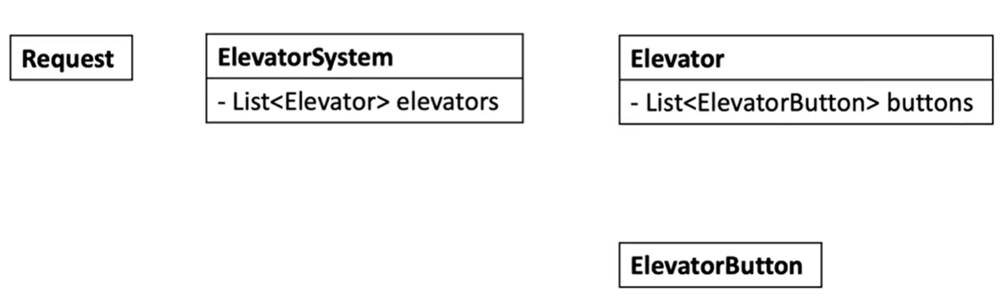
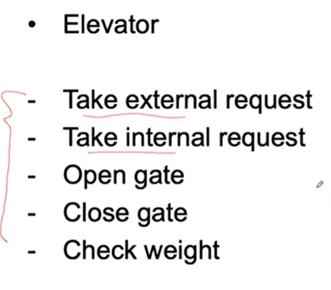
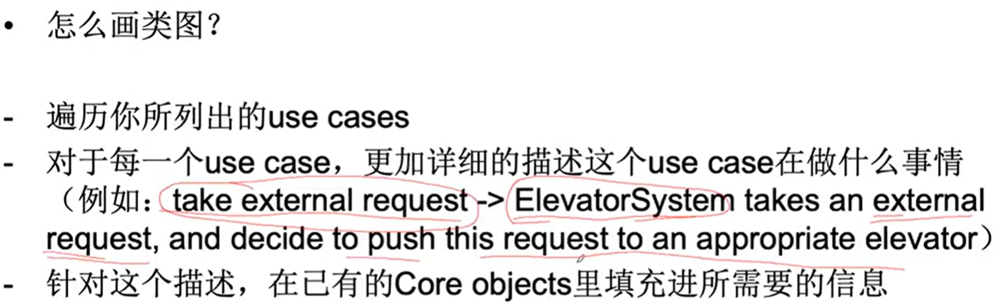

# 5C problem solving

## Clarify
### Key words: 属性， 如何提问对设计有帮助
- 如何获取目前电梯得重量
- 是否有两种不同的电梯
- 是否需要设计两种类别
- 三台电梯 此时按下按钮 哪一台去响应， 同方向 > 静止 > 反方向
- corner case: 电梯运行时 是否可以按下反方向按钮

### core object
- 如何定义core object
- 确定objects之间的关系
  - Elevator System: input & output 是什么
  

### Use case

### 类图
