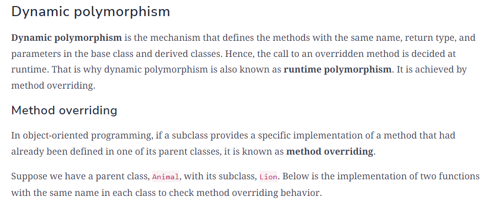

# OOD Background

## definition:
  - OOP is a programming style, not a tool, so despite being old, it’s vastly popular and established. This programming style involves dividing a program into pieces of objects that can communicate with each other. Every object has its own unique set of properties. These properties are later accessed and modified through the use of various operations.

## Building blocks of OOP
  - class: a blueprint for creating objects
  - Objects: instance of class, have state and behaviors
  - Attributes: are variables that represent the state of the object
  - Methods： are like functions that represent the behavior of the object. 

## Principles of OOP
  - Encapsulation
  - Abstraction
  - Inheritance
  - Polymorphism

### Encapsulation
- Encapsulation is a fundamental programming technique used to achieve data hiding in OOP. Encapsulation in OOP refers to binding data and the methods to manipulate that data together in a single unit—class.
  - Data Hiding: By making the data (fields) private, you restrict direct access to it from outside the class. This is achieved using access modifiers.
  - Controlled Access: Public getter and setter methods are provided to access and update the value of private fields. This allows for controlled and safe access to the fields.
  - Improved Maintainability: Changes to the implementation details of a class can be made without affecting the code that uses the class. This is because the internal details are hidden and only the interface (methods) is exposed.
  - Increased Flexibility: Encapsulation allows for more flexible code, as the internal representation of an object can be changed without affecting the outside code that depends on it.

### Abstraction 
- Definition: It is another fundamental principle of object-oriented programming (OOP) in Java. It is the concept of hiding the complex implementation details and showing only the essential features and behaviors of an object. Abstraction focuses on what an object does rather than how it does it. In software development, abstraction provides a similar benefit by allowing developers to interact with complex systems through simplified interfaces, improving both usability and maintainability.
- benefits:
  - It reduces the complexity of the system from a user's perspective.
  - It makes the code extendable and reusable.
  - It refines the modularity of the application or the system.
  - It makes the code more maintainable.

- In Java, abstraction can be achieved using abstract classes and interfaces.

#### Abstract Classes:
An abstract class is a class that cannot be instantiated on its own and may contain abstract methods (methods without a body) that must be implemented by subclasses.

#### Interfaces:
An interface is a reference type in Java, similar to a class, that can contain only constants, method signatures, default methods, static methods, and nested types. Interfaces cannot contain instance fields or constructors. A class that implements an interface must implement all the methods declared in the interface.

### Inheritance 
- Definition: provides a way to create a new class from an existing class. The new class is a specialized version of the existing class such that it inherits all the public attributes (variables) and methods of the existing class. The existing class is used as a starting point or base to create the new class.

### Polymorphism

In programming, polymorphism is a phenomenon that allows an object to have several different forms and behaviors

