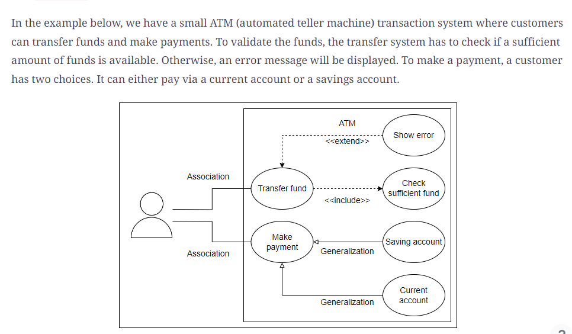
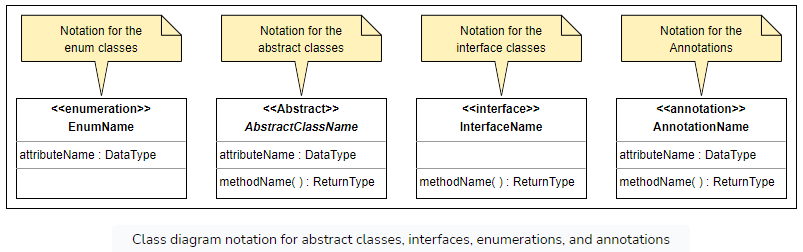

# OOD Principles

## OOAD

###  Software Development Life Cycle (SDLC)

## UML Diagrams
### Use Case

### Class

## Principles

### SRP
- A class should have only one reason to change. This implies that any class or component in our code should only have one functionality. Everything in the class should be related to just one goal.
- When programmers need to add features or new behavior, they frequently integrate everything within the current class. When something needs to be changed later, due to the complexity of the code, the update process becomes extremely time consuming and tedious. The Single Responsibility Principle helps us create simple classes that perform just one task. This helps in making modifications or adding extensions to the existing code much easier.

### OCP - Open Closed Principle
- A software artifact should be open for extension but closed for modification. This means that a system should improve easily by adding new code instead of changing the code core.  This means that a system should improve easily by adding new code instead of changing the code core. This way, the core code always retains its unique identity, making it reusable.
